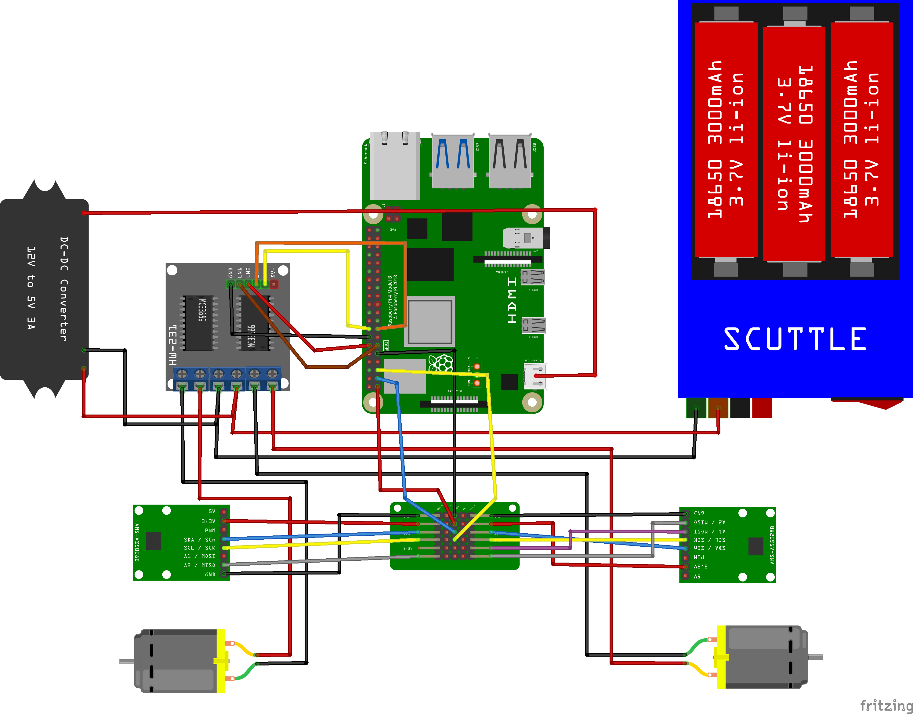

# SCUTTLE Fritzing Library

A library of parts for [Fritzing](http://fritzing.org/) to document [SCUTTLE](https://www.scuttlerobot.org/) projects. This library is provided for educational purposes only. We do not guarantee correctness of any part!

Released under Creative Commons CC0 Public Domain Dedication.

You can download each part individually through the GitHub UI or get all of them by cloning this project locally:

```console
git clone https://github.com/hipsterbrown/scuttle-fritzing.git
```

Clicking on the part zip file (.fzbz) should open it in Frizing.

If you wish to make it a permanent resident of your Fritzing parts palette, use the drop-down menu in the palette window and choose "Save Bin".

Example wiring diagram using these parts, including the Raspberry Pi Model B part from the [Adafruit Fritzing Library](https://github.com/adafruit/Fritzing-Library):



## Contributing

If you would like to add a relevant part to this library, please feel free to open a pull request. You can learn to [make your own Fritzing parts from SparkFun](https://learn.sparkfun.com/tutorials/make-your-own-fritzing-parts/all).

I used [Inkscape](http://www.inkscape.org/) to design the SVG breadboard view for each part.
